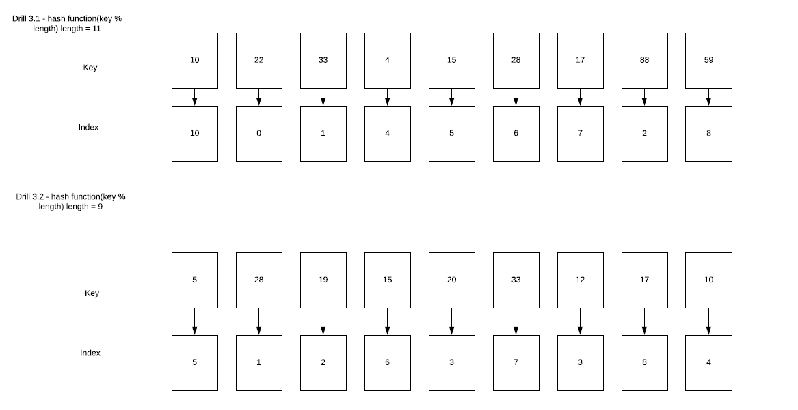

# DSA-HashMaps

## HashMaps Practice Drill

## Exercises

1. Create a HashMap class
   Walk through the HashMap implementation in the curriculum and understand it well. Then write a HashMap class and its core functions with open addressing as the collision resolution mechanism.

- Export your HashMap module
- Create a .js file called HashMaps_drills. In the file import the HashMap module. Create a function called main()
- Inside your main() function, create a hash map called lotr.
- For your hash map that you have created, set the MAX_LOAD_RATIO = 0.5 and SIZE_RATIO = 3.
- Add the following items to your hash map: {"Hobbit": "Bilbo"}, {"Hobbit": "Frodo"}, {"Wizard": "Gandolf"}, {"Human": "Aragorn"}, {"Elf": "Legolas"}, {"Maiar": "The Necromancer"}, {"Maiar": "Sauron"}, {"RingBearer": "Gollum"}, {"LadyOfLight": "Galadriel"}, {"HalfElven": "Arwen"}, {"Ent": "Treebeard"}
- Print your hash map and notice the length and items that are hashed in your hash map. - Have you hashed all the items you were asked to?
- Retrieve the value that is hashed in the key "Maiar" and Hobbit.
- What are the values of Maiar and Hobbit that you have? Is there a discrepancy? Explain your answer.
- What is the capacity of your hash table after you have hashed all the above items? Explain your answer.

2. WhatDoesThisDo
   DO NOT run the following code before solving the problem.

What is the output of the following code? explain your answer.

```
const WhatDoesThisDo = function(){
   let str1 = 'Hello World.';
   let str2 = 'Hello World.';
   let map1 = new HashMap();
   map1.set(str1,10);
   map1.set(str2,20);
   let map2 = new HashMap();
   let str3 = str1;
   let str4 = str2;
   map2.set(str3,20);
   map2.set(str4,10);

   console.log(map1.get(str1));
   console.log(map2.get(str3));
}
```

3. Demonstrate understanding of Hash maps
   _You don't need to write code for the following two drills. use any drawing app or simple pen and paper _

Show your hash map after the insertion of keys 10, 22, 31, 4, 15, 28, 17, 88, 59 into a hash map of length 11 using open addressing and a hash function k mod m, where k is the key and m is the length.

Show your hash map after the insertion of the keys 5, 28, 19, 15, 20, 33, 12, 17, 10 into the hash map with collisions resolved by separate chaining. Let the hash table have a length m = 9, and let the hash function be k mod m.

- Answer
  

4. Remove duplicates
   Implement a function to delete all duplicated characters in a string and keep only the first occurrence of each character. For example, if the input is string “google”, the result after deletion is “gole”. Test your program with a sentence as well such as "google all that you think can think of".

5. Any permutation a palindrome
   Write an algorithm to check whether any permutation of a string is a palindrome. Given the string "acecarr", the algorithm should return true, because the letters in "acecarr" can be rearranged to "racecar", which is a palindrome. In contrast, given the word "north", the algorithm should return false, because there's no way to rearrange those letters to be a palindrome.

6. Anagram grouping
   Write an algorithm to group a list of words into anagrams. For example, if the input was ['east', 'cars', 'acre', 'arcs', 'teas', 'eats', 'race'], the output should be: [['east', 'teas', 'eats'], ['cars', 'arcs'], ['acre', 'race']].

7. Separate Chaining
   Write another hash map implementation as above, but use separate chaining as the collision resolution mechanism.

Test your hash map with the same values from the lotr hash map.
